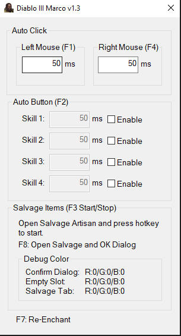

# Diablo III Auto Marco
Tool bảo vệ chuột và bàn phím cho Diablo III

Phát triển từ code gốc của: https://github.com/langmaninternet/DialoIIISupport

Download
------------
https://github.com/Mitonios/DiabloIIIMarco/archive/master.zip

Screenshot
------------

Các tính năng chính
------------
- F1: Tự động bấm chuột trái
- F3: Tự động bấm chuột phải
- F2: Tự động bấm Hotkey từ 1=>4
- F4: Tự động Salvage đồ thừa (Cả Legendary Items)
- F5: Tự động bấm Q (Hồi máu) nếu dưới 50% máu

Dev
------------
[Mitonios](http://mitonios.com/)
